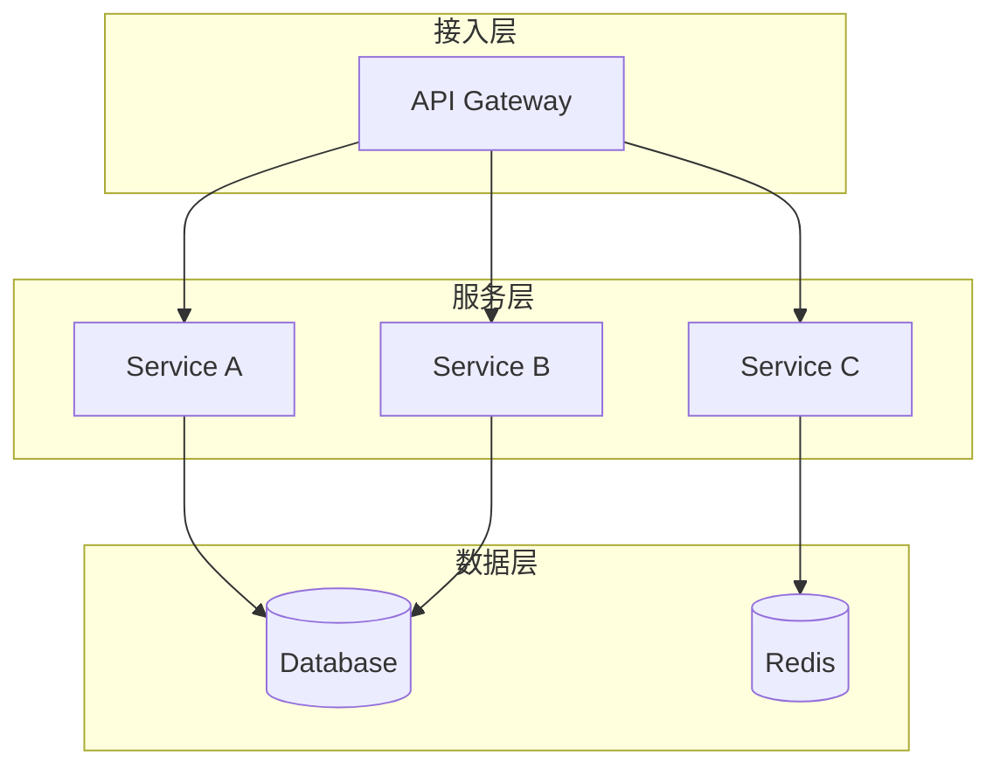
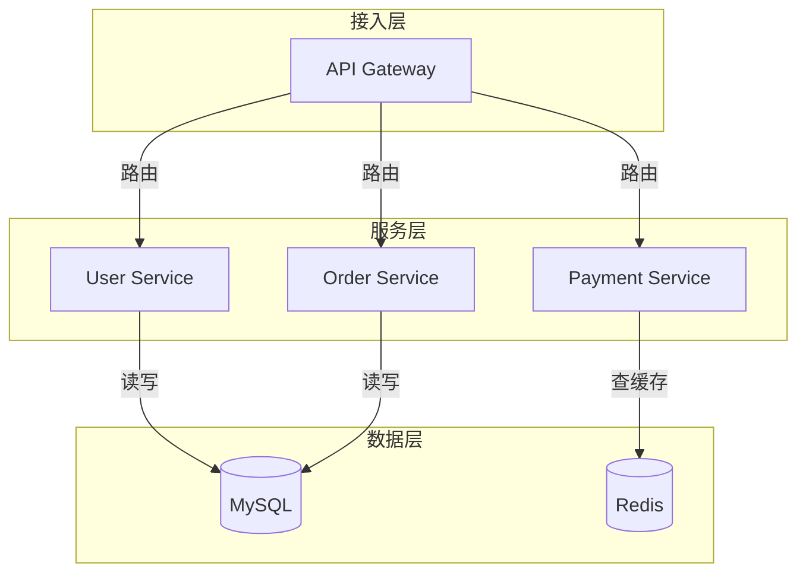
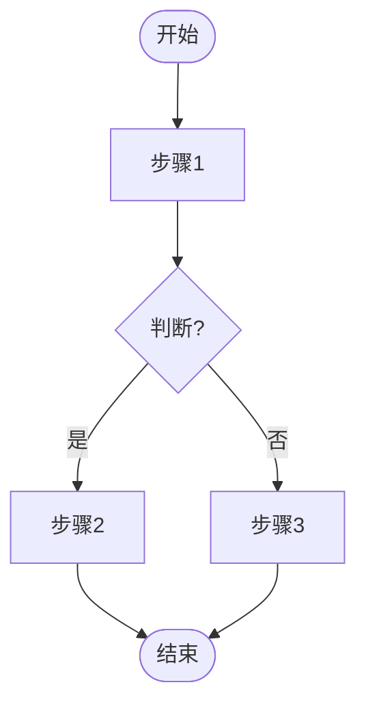
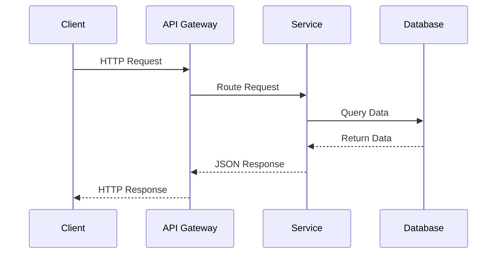
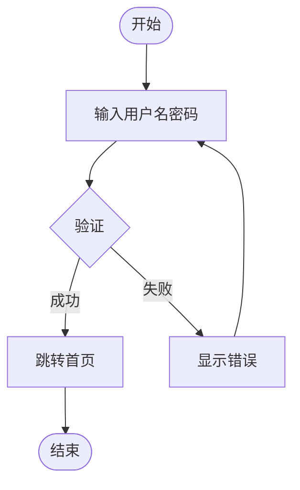
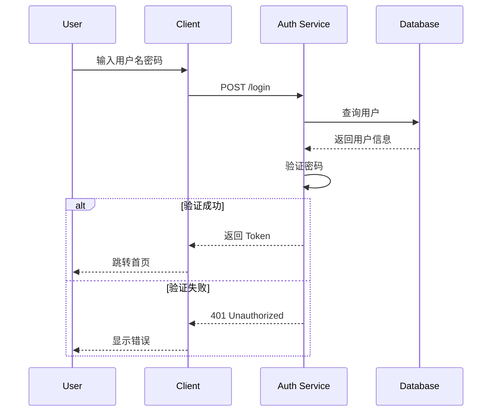

# fc-arch-card Skill Implementation Plan

> **For agentic workers:** REQUIRED SUB-SKILL: Use superpowers:subagent-driven-development (recommended) or superpowers:executing-plans to implement this plan task-by-task. Steps use checkbox (`- [ ]`) syntax for tracking.

**Goal:** 实现一个接收自然语言描述并输出技术架构图的 Claude Code skill，支持 Mermaid 渲染、4 种风格主题、降级到手写 SVG。

**Architecture:** 核心架构包含 SKILL.md 路由器、Python Playwright 截图工具、本地 HTTP 渲染服务、Mermaid 模板和风格配置。输入经参数解析后，通过 LLM 生成 Mermaid DSL，注入模板后由本地服务提供渲染，Playwright 截图输出 PNG，失败时降级为手写 SVG 重新渲染。

**Tech Stack:** Python 3.10+, Playwright (Python), Mermaid.js (浏览器渲染), Chromium 无头浏览器

---

## File Structure

```
fc-arch-card/
├── SKILL.md                   # 主路由器：参数解析、任务分发、结果输出
├── requirements.txt           # playwright 依赖
├── scripts/
│   └── run.sh                 # 启动脚本（uv run wrapper）
└── assets/
    ├── capture.py             # Playwright 截图工具（含降级检测、SVG 提取）
    ├── render_server.py       # 本地 HTTP 服务（提供模板渲染）
    └── template.html          # Mermaid 渲染容器

references/
├── taste.md                   # 视觉质量底线约束
├── themes.md                  # 4 种风格 CSS 变量配置
├── mode-arch.md               # 系统架构图执行步骤
└── mode-flow.md               # 流程图/时序图执行步骤
```

---

## Task 1: 创建目录结构

**Files:**
- Create directory: `fc-arch-card/`
- Create directory: `fc-arch-card/scripts/`
- Create directory: `fc-arch-card/assets/`
- Create directory: `fc-arch-card/references/`

- [ ] **Step 1: Create directory structure**

```bash
mkdir -p /Users/jiangfachang/Code/AICoding/fc-skills/fc-arch-card/{scripts,assets,references}
```

- [ ] **Step 2: Verify directories created**

```bash
ls -la /Users/jiangfachang/Code/AICoding/fc-skills/fc-arch-card/
```

Expected: Shows `scripts`, `assets`, `references` directories

- [ ] **Step 3: Commit**

```bash
git add fc-arch-card/
git commit -m "chore: create fc-arch-card skill directory structure"
```

---

## Task 2: 创建 requirements.txt

**Files:**
- Create: `fc-arch-card/requirements.txt`

- [ ] **Step 1: Write requirements.txt**

```
playwright>=1.40.0
```

- [ ] **Step 2: Verify file content**

```bash
cat /Users/jiangfachang/Code/AICoding/fc-skills/fc-arch-card/requirements.txt
```

Expected: Shows `playwright>=1.40.0`

- [ ] **Step 3: Commit**

```bash
git add fc-arch-card/requirements.txt
git commit -m "chore: add fc-arch-card requirements.txt with playwright"
```

---

## Task 3: 创建 references/taste.md（视觉质量底线）

**Files:**
- Create: `fc-arch-card/references/taste.md`

- [ ] **Step 1: Write taste.md**

```markdown
# 架构图视觉质量底线

## 节点规范

- **标签长度**: ≤ 20 字符（中文按 2 字符/字计算）
- **命名风格**: 简洁描述性名词，避免动词开头
- **中英文**: 单图统一，不混用

## 连线规范

- **方向性**: 每条线必须有箭头（明确数据流方向）
- **标注长度**: ≤ 10 字符
- **颜色语义**: 同步调用用实线，异步用虚线

## 布局规范

- **Subgraph 嵌套**: ≤ 3 层（避免理解难度陡增）
- **节点总数**: ≤ 20 个（保持可读性）
- **分组逻辑**: 同类组件放同一 subgraph

## 输出规范

- **宽度**: 固定 1080px
- **高度**: 自动撑开
- **边距**: 四周 48px 内边距
- **背景**: 按主题色填充，无透明区域

## 禁止项

- ❌ 无方向连线（缺少箭头）
- ❌ 节点平铺无分组
- ❌ 超过 3 层嵌套
- ❌ 标签超过 20 字符
- ❌ 中英文混用
```

- [ ] **Step 2: Verify file**

```bash
head -20 /Users/jiangfachang/Code/AICoding/fc-skills/fc-arch-card/references/taste.md
```

Expected: Shows "# 架构图视觉质量底线"

- [ ] **Step 3: Commit**

```bash
git add fc-arch-card/references/taste.md
git commit -m "docs: add visual quality constraints for arch diagrams"
```

---

## Task 4: 创建 references/themes.md（4 种风格主题）

**Files:**
- Create: `fc-arch-card/references/themes.md`

- [ ] **Step 1: Write themes.md**

```markdown
# 架构图风格主题配置

## engineering (-e) 工程极简

**适用场景**: 技术文档、RFC、C4 模型

```yaml
BG_COLOR: "#FFFFFF"
FONT_FAMILY: "JetBrains Mono, monospace"
MERMAID_THEME: base
MERMAID_VARS:
  primaryColor: "#FFFFFF"
  primaryBorderColor: "#333333"
  primaryTextColor: "#333333"
  lineColor: "#666666"
  secondaryColor: "#F5F5F5"
  tertiaryColor: "#FFFFFF"
```

## modern (-m) 现代设计感

**适用场景**: Figma 社区图、产品架构展示

```yaml
BG_COLOR: "#F8F9FC"
FONT_FAMILY: "Geist, sans-serif"
MERMAID_THEME: base
MERMAID_VARS:
  primaryColor: "#3B5BDB"
  primaryBorderColor: "#2F4AC0"
  primaryTextColor: "#FFFFFF"
  lineColor: "#3B5BDB"
  secondaryColor: "#EEF2FF"
  tertiaryColor: "#F8F9FC"
```

## dark (-d) 暗黑风

**适用场景**: 终端风格、监控大屏、深色主题文档

```yaml
BG_COLOR: "#1A1A2E"
FONT_FAMILY: "JetBrains Mono, monospace"
MERMAID_THEME: dark
MERMAID_VARS:
  primaryColor: "#16213E"
  primaryBorderColor: "#0F3460"
  primaryTextColor: "#E0E0E0"
  lineColor: "#00B4D8"
  secondaryColor: "#1A1A2E"
  tertiaryColor: "#16213E"
```

## colorful (-c) 彩色自定义

**适用场景**: 博客配图、教学演示

**颜色映射**:
- 网关/API: #FF6B35 (橙)
- 服务: #3B5BDB (蓝)
- 存储: "#22C55E" (绿)
- 队列: "#A855F7" (紫)
- 缓存: "#F59E0B" (黄)
- 外部: "#6B7280" (灰)

```yaml
BG_COLOR: "#FAFAFA"
FONT_FAMILY: "Outfit, sans-serif"
MERMAID_THEME: base
MERMAID_VARS:
  primaryColor: "#3B5BDB"
  primaryBorderColor: "#2F4AC0"
  primaryTextColor: "#FFFFFF"
  lineColor: "#666666"
  secondaryColor: "#F3F4F6"
  tertiaryColor: "#FAFAFA"
```

## 风格快速选择指南

| 需求 | 推荐风格 |
|------|----------|
| 技术文档/架构评审 | -e |
| 产品演示/设计稿 | -m |
| 深色模式/大屏 | -d |
| 教学/博客配图 | -c |
```

- [ ] **Step 2: Verify file**

```bash
head -30 /Users/jiangfachang/Code/AICoding/fc-skills/fc-arch-card/references/themes.md
```

Expected: Shows "# 架构图风格主题配置"

- [ ] **Step 3: Commit**

```bash
git add fc-arch-card/references/themes.md
git commit -m "docs: add 4 visual theme configurations for arch diagrams"
```

---

## Task 5: 创建 references/mode-arch.md（系统架构图执行步骤）

**Files:**
- Create: `fc-arch-card/references/mode-arch.md`

- [ ] **Step 1: Write mode-arch.md**

```markdown
# 系统架构图执行步骤

## 1. 理解输入

识别用户描述中的关键要素：

- **组件类型**: 服务、存储、网关、缓存、队列、外部系统
- **连接关系**: 谁调用谁、数据流向、依赖关系
- **分层逻辑**: 接入层、服务层、数据层

## 2. 生成 Mermaid DSL

使用 `graph TD` (从上到下) 或 `graph LR` (从左到右) 语法。

### 结构模板



### 语法规则

- **节点定义**: `ID[标签]` (矩形)、`ID((标签))` (圆形)、`ID[(标签)]` (圆柱)
- **连线**: `-->` (实线箭头)、`-.->` (虚线箭头)、`-->|标注|-->` (带标注)
- **分组**: `subgraph 名称 ... end`

## 3. DSL 自检

生成后检查：

- [ ] 节点总数 ≤ 20
- [ ] Subgraph 嵌套层数 ≤ 3
- [ ] 每条线都有方向（箭头）
- [ ] 节点标签 ≤ 20 字符
- [ ] 中英文不混用
- [ ] 同类组件在同一 subgraph

## 4. 风格适配

根据用户选择的主题（-e/-m/-d/-c），从 themes.md 读取对应配置：

1. 提取 `BG_COLOR`、`FONT_FAMILY`、`MERMAID_VARS`
2. 将 `MERMAID_VARS` 注入 Mermaid init 配置

## 5. 输出示例

**输入**: "画一个电商系统，包含网关、用户服务、订单服务、支付服务、MySQL 和 Redis"

**输出 DSL**:



## 6. 命名生成

根据图表内容自动生成文件名（英文小写，连字符连接）：

- 电商系统架构图 → `ecommerce-system-architecture`
- 用户注册流程图 → `user-registration-flow`
```

- [ ] **Step 2: Verify file**

```bash
grep -A 5 "理解输入" /Users/jiangfachang/Code/AICoding/fc-skills/fc-arch-card/references/mode-arch.md
```

Expected: Shows "识别用户描述中的关键要素"

- [ ] **Step 3: Commit**

```bash
git add fc-arch-card/references/mode-arch.md
git commit -m "docs: add system architecture diagram execution steps"
```

---

## Task 6: 创建 references/mode-flow.md（流程图/时序图执行步骤）

**Files:**
- Create: `fc-arch-card/references/mode-flow.md`

- [ ] **Step 1: Write mode-flow.md**

```markdown
# 流程图/时序图执行步骤

## 1. 判断子类型

根据用户描述判断使用哪种语法：

| 特征 | 推荐类型 | Mermaid 语法 |
|------|----------|--------------|
| 多参与者交互 | 时序图 | `sequenceDiagram` |
| 单线流程、判断分支 | 流程图 | `flowchart TD` |

## 2. 流程图 (flowchart TD)

### 结构模板



### 节点形状

- `[文本]` - 矩形（处理步骤）
- `{文本}` - 菱形（判断）
- `([文本])` - 圆角矩形（开始/结束）
- `[(文本)]` - 圆柱形（数据库）

## 3. 时序图 (sequenceDiagram)

### 结构模板



### 消息类型

- `->>` - 实线箭头（同步消息）
- `-->>` - 虚线箭头（返回消息）
- `-x>` - 实线叉（消息丢失）
- `->>+` - 激活 lifeline（开始处理）
- `-->>-` -  deactivate lifeline（结束处理）

## 4. DSL 自检

生成后检查：

- [ ] 流程图：步骤数 ≤ 15
- [ ] 时序图：参与者数 ≤ 6
- [ ] 流程图：有明确开始和结束节点
- [ ] 判断分支：标注条件（是/否 或 success/fail）
- [ ] 时序图：消息有明确方向

## 5. 风格适配

与 mode-arch.md 相同，从 themes.md 读取配置注入 Mermaid init。

## 6. 输出示例

**输入**: "画用户登录流程，包括输入密码、验证、成功或失败跳转"

**输出 DSL (流程图)**:



**输出 DSL (时序图)**:



## 7. 命名生成

- 用户登录流程图 → `user-login-flow`
- 支付流程时序图 → `payment-process-sequence`
```

- [ ] **Step 2: Verify file**

```bash
grep "判断子类型" /Users/jiangfachang/Code/AICoding/fc-skills/fc-arch-card/references/mode-flow.md
```

Expected: Shows "根据用户描述判断使用哪种语法"

- [ ] **Step 3: Commit**

```bash
git add fc-arch-card/references/mode-flow.md
git commit -m "docs: add flowchart and sequence diagram execution steps"
```

---

## Task 7: 创建 assets/template.html（Mermaid 渲染容器）

**Files:**
- Create: `fc-arch-card/assets/template.html`

- [ ] **Step 1: Write template.html**

```html
<!DOCTYPE html>
<html>
<head>
  <meta charset="UTF-8">
  <style>
    * {
      margin: 0;
      padding: 0;
      box-sizing: border-box;
    }
    body {
      margin: 0;
      background: {{BG_COLOR}};
      font-family: {{FONT_FAMILY}};
      min-height: 100vh;
    }
    .diagram-wrapper {
      padding: 48px;
      display: flex;
      justify-content: center;
      align-items: flex-start;
    }
    .mermaid {
      width: 100%;
      max-width: 1080px;
    }
  </style>
</head>
<body>
  <div class="diagram-wrapper">
    <pre class="mermaid">
%%{init: {{MERMAID_THEME_CONFIG}}}%%
{{MERMAID_DSL}}
    </pre>
  </div>
  <script src="https://cdn.jsdelivr.net/npm/mermaid@10/dist/mermaid.min.js"></script>
  <script>
    mermaid.initialize({
      startOnLoad: true,
      securityLevel: 'loose',
      theme: '{{MERMAID_THEME}}'
    });
  </script>
</body>
</html>
```

- [ ] **Step 2: Verify file**

```bash
grep "BG_COLOR" /Users/jiangfachang/Code/AICoding/fc-skills/fc-arch-card/assets/template.html
```

Expected: Shows `background: {{BG_COLOR}};`

- [ ] **Step 3: Commit**

```bash
git add fc-arch-card/assets/template.html
git commit -m "feat: add Mermaid rendering template with placeholder variables"
```

---

## Task 8: 创建 assets/render_server.py（本地 HTTP 渲染服务）

**Files:**
- Create: `fc-arch-card/assets/render_server.py`

- [ ] **Step 1: Write render_server.py**

```python
"""本地 HTTP 服务，用于提供 Mermaid 渲染页面。"""

import http.server
import socketserver
import threading
import webbrowser
from pathlib import Path


class RenderHandler(http.server.SimpleHTTPRequestHandler):
    """自定义请求处理器，从 assets 目录提供文件。"""

    def __init__(self, *args, assets_dir=None, **kwargs):
        self.assets_dir = assets_dir or Path(__file__).parent
        super().__init__(*args, **kwargs)

    def translate_path(self, path):
        """重写路径解析，指向 assets 目录。"""
        # 移除开头的 /
        path = path.lstrip('/')
        # 构建完整路径
        return str(self.assets_dir / path)

    def log_message(self, format, *args):
        """静默日志输出。"""
        pass


class RenderServer:
    """渲染服务器，提供本地 HTTP 服务用于 Mermaid 渲染。"""

    def __init__(self, port=0, assets_dir=None):
        self.port = port
        self.assets_dir = assets_dir or Path(__file__).parent
        self.server = None
        self.thread = None
        self._actual_port = None

    def start(self):
        """启动服务器，返回实际端口号。"""
        handler = lambda *args, **kwargs: RenderHandler(
            *args, assets_dir=self.assets_dir, **kwargs
        )

        self.server = socketserver.TCPServer(("localhost", self.port), handler)
        self._actual_port = self.server.socket.getsockname()[1]

        self.thread = threading.Thread(target=self.server.serve_forever)
        self.thread.daemon = True
        self.thread.start()

        return self._actual_port

    def stop(self):
        """停止服务器。"""
        if self.server:
            self.server.shutdown()
            self.server.server_close()
            self.thread.join(timeout=5)

    @property
    def actual_port(self):
        """获取实际分配的端口号。"""
        return self._actual_port

    def get_url(self, path=""):
        """获取完整 URL。"""
        return f"http://localhost:{self.actual_port}/{path}"


def start_server(assets_dir=None, port=0):
    """便捷函数：启动服务器并返回实例。

    Args:
        assets_dir: assets 目录路径，默认使用脚本所在目录
        port: 指定端口，0 表示自动分配

    Returns:
        RenderServer 实例
    """
    server = RenderServer(port=port, assets_dir=assets_dir)
    actual_port = server.start()
    return server


if __name__ == "__main__":
    # 测试模式
    import sys

    assets_dir = Path(__file__).parent
    if len(sys.argv) > 1:
        assets_dir = Path(sys.argv[1])

    server = RenderServer(assets_dir=assets_dir)
    port = server.start()
    print(f"Server started at http://localhost:{port}/")
    print(f"Serving files from: {assets_dir}")

    try:
        input("Press Enter to stop...")
    finally:
        server.stop()
        print("Server stopped.")
```

- [ ] **Step 2: Verify file**

```bash
grep "class RenderServer" /Users/jiangfachang/Code/AICoding/fc-skills/fc-arch-card/assets/render_server.py
```

Expected: Shows `class RenderServer:`

- [ ] **Step 3: Commit**

```bash
git add fc-arch-card/assets/render_server.py
git commit -m "feat: add local HTTP render server for Mermaid"
```

---

## Task 9: 创建 assets/capture.py（Playwright 截图工具）

**Files:**
- Create: `fc-arch-card/assets/capture.py`

- [ ] **Step 1: Write capture.py**

```python
"""Playwright 截图工具，用于渲染 Mermaid 图表并输出 PNG/SVG。"""

import argparse
import sys
import time
from pathlib import Path

from playwright.sync_api import sync_playwright, TimeoutError as PlaywrightTimeout


def capture_diagram(
    html_url: str,
    output_png: str,
    output_svg: str = None,
    timeout: int = 30000,
) -> dict:
    """使用 Playwright 截图图表。

    Args:
        html_url: 本地 HTTP 服务的 HTML 页面 URL
        output_png: 输出的 PNG 文件路径
        output_svg: 可选，输出的 SVG 文件路径
        timeout: 等待渲染超时时间（毫秒）

    Returns:
        dict 包含结果信息
        - success: bool
        - error: str 或 None
        - render_failed: bool（Mermaid 渲染失败标志）
    """
    result = {
        "success": False,
        "error": None,
        "render_failed": False,
    }

    with sync_playwright() as p:
        browser = p.chromium.launch(headless=True)
        page = browser.new_page(viewport={"width": 1200, "height": 800})

        try:
            # 访问页面
            page.goto(html_url, wait_until="networkidle", timeout=timeout)

            # 等待 Mermaid 渲染完成
            page.wait_for_selector(".mermaid svg", timeout=10000)

            # 检查是否有渲染错误
            error_icon = page.query_selector(".mermaid .error-icon")
            if error_icon:
                result["render_failed"] = True
                result["error"] = "Mermaid rendering failed (syntax error)"
                browser.close()
                return result

            # 等待一下确保渲染稳定
            time.sleep(0.5)

            # 获取 SVG 元素并截图
            svg_element = page.query_selector(".mermaid svg")
            if not svg_element:
                result["error"] = "SVG element not found after rendering"
                browser.close()
                return result

            # PNG 截图
            svg_element.screenshot(path=output_png)
            result["success"] = True

            # SVG 提取（如果请求）
            if output_svg:
                svg_content = svg_element.evaluate("el => el.outerHTML")
                Path(output_svg).write_text(svg_content, encoding="utf-8")

        except PlaywrightTimeout:
            result["error"] = f"Timeout waiting for rendering ({timeout}ms)"
        except Exception as e:
            result["error"] = str(e)
        finally:
            browser.close()

    return result


def main():
    """CLI 入口。"""
    parser = argparse.ArgumentParser(description="Capture Mermaid diagram screenshot")
    parser.add_argument("--url", required=True, help="HTML page URL")
    parser.add_argument("--output", required=True, help="Output PNG file path")
    parser.add_argument("--svg", help="Optional output SVG file path")
    parser.add_argument(
        "--timeout", type=int, default=30000, help="Timeout in milliseconds"
    )

    args = parser.parse_args()

    result = capture_diagram(
        html_url=args.url,
        output_png=args.output,
        output_svg=args.svg,
        timeout=args.timeout,
    )

    if result["success"]:
        print(f"SUCCESS: PNG saved to {args.output}")
        if args.svg:
            print(f"SUCCESS: SVG saved to {args.svg}")
        sys.exit(0)
    elif result["render_failed"]:
        print(f"RENDER_FAILED: {result['error']}", file=sys.stderr)
        sys.exit(2)
    else:
        print(f"ERROR: {result['error']}", file=sys.stderr)
        sys.exit(1)


if __name__ == "__main__":
    main()
```

- [ ] **Step 2: Verify file**

```bash
grep "def capture_diagram" /Users/jiangfachang/Code/AICoding/fc-skills/fc-arch-card/assets/capture.py
```

Expected: Shows `def capture_diagram(`

- [ ] **Step 3: Commit**

```bash
git add fc-arch-card/assets/capture.py
git commit -m "feat: add Playwright screenshot tool with render failure detection"
```

---

## Task 10: 创建 scripts/run.sh（启动脚本）

**Files:**
- Create: `fc-arch-card/scripts/run.sh`

- [ ] **Step 1: Write run.sh**

```bash
#!/bin/bash
# fc-arch-card 启动脚本

set -e

SCRIPT_DIR="$(cd "$(dirname "${BASH_SOURCE[0]}")" && pwd)"
PROJECT_DIR="$(dirname "$SCRIPT_DIR")"

# 切换到项目目录
cd "$PROJECT_DIR"

# 检查依赖
if ! command -v uv &> /dev/null; then
    echo "Error: uv is not installed"
    exit 1
fi

# 安装依赖（如果未安装）
if [ ! -d ".venv" ]; then
    echo "Creating virtual environment..."
    uv venv
fi

# 安装依赖
uv pip install -r requirements.txt -q

# 安装 Playwright chromium（如果未安装）
if ! uv run python -c "from playwright.sync_api import sync_playwright; p = sync_playwright().start(); p.chromium.launch(headless=True); p.stop()" 2>/dev/null; then
    echo "Installing Playwright chromium browser..."
    uv run playwright install chromium
fi

# 运行主程序
uv run python -c "
import sys
sys.path.insert(0, '$PROJECT_DIR')
from assets.capture import capture_diagram
from assets.render_server import start_server

print('fc-arch-card dependencies ready')
print('Use: uv run python assets/capture.py --url <url> --output <png>')
"
```

- [ ] **Step 2: Make executable**

```bash
chmod +x /Users/jiangfachang/Code/AICoding/fc-skills/fc-arch-card/scripts/run.sh
```

- [ ] **Step 3: Verify file**

```bash
head -10 /Users/jiangfachang/Code/AICoding/fc-skills/fc-arch-card/scripts/run.sh
```

Expected: Shows shebang and script header

- [ ] **Step 4: Commit**

```bash
git add fc-arch-card/scripts/run.sh
git commit -m "feat: add run.sh setup script for dependencies"
```

---

## Task 11: 创建 SKILL.md（主路由器）

**Files:**
- Create: `fc-arch-card/SKILL.md`

- [ ] **Step 1: Write SKILL.md**

```markdown
---
name: fc-arch-card
description: |
  接收自然语言描述，输出技术架构图（PNG，可选 SVG）。支持 4 种视觉风格（工程极简、现代设计、暗黑、彩色自定义）和 2 种图表类型（系统架构图、流程图/时序图）。
  触发场景：用户说"画架构图"、"画流程图"、"画系统图"、"生成架构图"等。
  示例：画一个包含 API Gateway、三个微服务和 Redis 的系统架构图 -m
metadata:
  clawdbot:
    emoji: "📐"
    requires:
      bins: ["uv"]
---

# fc-arch-card - 技术架构图生成

接收自然语言描述，输出专业风格的技术架构图。

## 使用方式

```bash
# 系统架构图（默认风格：工程极简）
/fc-arch-card 画一个电商系统架构，包含网关、用户服务、订单服务、MySQL 和 Redis

# 指定现代设计风格
/fc-arch-card 画一个微服务架构 -m

# 暗黑风格流程图
/fc-arch-card 画用户登录流程图 -f -d

# 输出 SVG 额外格式
/fc-arch-card 画一个推荐系统架构 -c -svg
```

## 参数说明

| 参数 | 含义 | 默认 |
|------|------|------|
| `-a` | 系统架构图 | ✓ |
| `-f` | 流程图/时序图 | |
| `-e` | 工程极简风格 | ✓ |
| `-m` | 现代设计感 | |
| `-d` | 暗黑风 | |
| `-c` | 彩色自定义 | |
| `-svg` | 额外输出 SVG | |

## 工作流程

```
用户输入 → 解析参数 → 读取配置 → 生成 Mermaid DSL
    → 填充模板 → 启动服务 → Playwright 截图 → 输出 PNG
    → [失败] → 降级手写 SVG → 重新截图
```

## 输出位置

图表保存至 `~/Downloads/{name}.png`：
- `{name}` 根据图表内容自动生成（英文小写，连字符连接）
- 如带 `-svg` 参数，同时输出 `~/Downloads/{name}.svg`

## 风格预览

| 参数 | 风格 | 适用场景 |
|------|------|----------|
| `-e` | 工程极简 | 技术文档、RFC、架构评审 |
| `-m` | 现代设计感 | 产品演示、设计稿 |
| `-d` | 暗黑风 | 深色模式文档、监控大屏 |
| `-c` | 彩色自定义 | 教学演示、博客配图 |

## 实现细节

### 渲染流程

1. **参数解析**：提取图表类型、风格、输出格式
2. **读取配置**：从 references/ 读取风格变量和执行步骤
3. **生成 DSL**：LLM 根据描述生成 Mermaid 语法
4. **填充模板**：将 DSL 和主题变量注入 template.html
5. **启动服务**：render_server.py 在本地端口提供服务
6. **Playwright 截图**：capture.py 访问页面并截图
7. **降级处理**：Mermaid 失败时，LLM 生成手写 SVG 重新渲染

### 文件结构

```
fc-arch-card/
├── SKILL.md              # 本文件（路由器）
├── requirements.txt      # playwright 依赖
├── scripts/
│   └── run.sh            # 依赖安装脚本
└── assets/
    ├── capture.py        # Playwright 截图
    ├── render_server.py  # 本地 HTTP 服务
    └── template.html     # Mermaid 模板

references/
├── taste.md              # 视觉质量约束
├── themes.md             # 4 种风格配置
├── mode-arch.md          # 架构图步骤
└── mode-flow.md          # 流程图步骤
```

## 依赖

- Python 3.10+
- Playwright (Python)
- Chromium 浏览器（Playwright 自动安装）

安装命令：
```bash
uv add playwright
uv run playwright install chromium
```

## 注意事项

- **Mermaid 语法错误**：会自动降级为手写 SVG 重新渲染
- **节点数量限制**：建议不超过 20 个节点以保持可读性
- **命名规范**：自动生成的文件名使用英文小写和连字符
```

- [ ] **Step 2: Verify file**

```bash
grep "fc-arch-card" /Users/jiangfachang/Code/AICoding/fc-skills/fc-arch-card/SKILL.md | head -3
```

Expected: Shows title and description

- [ ] **Step 3: Commit**

```bash
git add fc-arch-card/SKILL.md
git commit -m "feat: add main SKILL.md router with usage docs"
```

---

## Task 12: 安装依赖并验证

**Files:**
- Modify: `fc-arch-card/` (install dependencies)

- [ ] **Step 1: Install dependencies with uv**

```bash
cd /Users/jiangfachang/Code/AICoding/fc-skills/fc-arch-card
uv venv
uv pip install -r requirements.txt
```

Expected: Shows installation progress, completes without errors

- [ ] **Step 2: Install Playwright chromium**

```bash
uv run playwright install chromium
```

Expected: Shows browser download progress, completes successfully

- [ ] **Step 3: Test import**

```bash
uv run python -c "from playwright.sync_api import sync_playwright; print('Playwright OK')"
```

Expected: Shows `Playwright OK`

- [ ] **Step 4: Commit (if .venv files changed)**

```bash
git status
```

Expected: .venv 应被 .gitignore 忽略，无新增文件

---

## Task 13: 最终验证

**Files:**
- Verify: All files in `fc-arch-card/`

- [ ] **Step 1: List all created files**

```bash
find /Users/jiangfachang/Code/AICoding/fc-skills/fc-arch-card -type f | sort
```

Expected:
```
fc-arch-card/SKILL.md
fc-arch-card/assets/capture.py
fc-arch-card/assets/render_server.py
fc-arch-card/assets/template.html
fc-arch-card/references/mode-arch.md
fc-arch-card/references/mode-flow.md
fc-arch-card/references/taste.md
fc-arch-card/references/themes.md
fc-arch-card/requirements.txt
fc-arch-card/scripts/run.sh
```

- [ ] **Step 2: Verify Python syntax**

```bash
cd /Users/jiangfachang/Code/AICoding/fc-skills/fc-arch-card
uv run python -m py_compile assets/capture.py assets/render_server.py
echo "Syntax OK"
```

Expected: Shows `Syntax OK` (no errors)

- [ ] **Step 3: Final commit**

```bash
cd /Users/jiangfachang/Code/AICoding/fc-skills
git add fc-arch-card/
git status
git commit -m "feat: complete fc-arch-card skill implementation"
```

Expected: Shows clean commit

---

## 后续手动测试步骤（不在自动化计划中）

1. **测试渲染服务**
   ```bash
   cd fc-arch-card
   uv run python assets/render_server.py
   # 访问 http://localhost:<port>/template.html
   ```

2. **测试截图工具**
   ```bash
   # 先启动 render_server
   uv run python assets/capture.py --url http://localhost:PORT/template.html --output test.png
   ```

3. **完整集成测试**
   - 通过 `/fc-arch-card` 命令触发
   - 验证参数解析
   - 验证输出文件生成

---

## Spec Coverage Check

| 设计要求 | 实现任务 |
|----------|----------|
| CLI 参数解析 (-a/-f, -e/-m/-d/-c, -svg) | Task 11 (SKILL.md 文档) |
| Python Playwright 渲染 | Task 9 (capture.py) |
| 本地 HTTP 服务 | Task 8 (render_server.py) |
| 4 种风格主题配置 | Task 4 (themes.md) |
| Mermaid DSL 生成步骤 | Task 5-6 (mode-arch.md, mode-flow.md) |
| 降级到手写 SVG | Task 9 (capture.py 支持 RENDER_FAILED 检测) |
| 输出到 ~/Downloads | Task 11 (SKILL.md 文档说明) |
| 视觉质量约束 | Task 3 (taste.md) |
| Mermaid 模板 | Task 7 (template.html) |

---

## Plan Self-Review

**Placeholder scan:** ✅ 无 TBD/TODO/实现 later
**Type consistency:** ✅ capture_diagram 参数名一致
**Code completeness:** ✅ 每个任务包含完整代码
**Command correctness:** ✅ 使用 uv 符合项目规范
**File count check:** ✅ 10 个文件，符合架构设计
