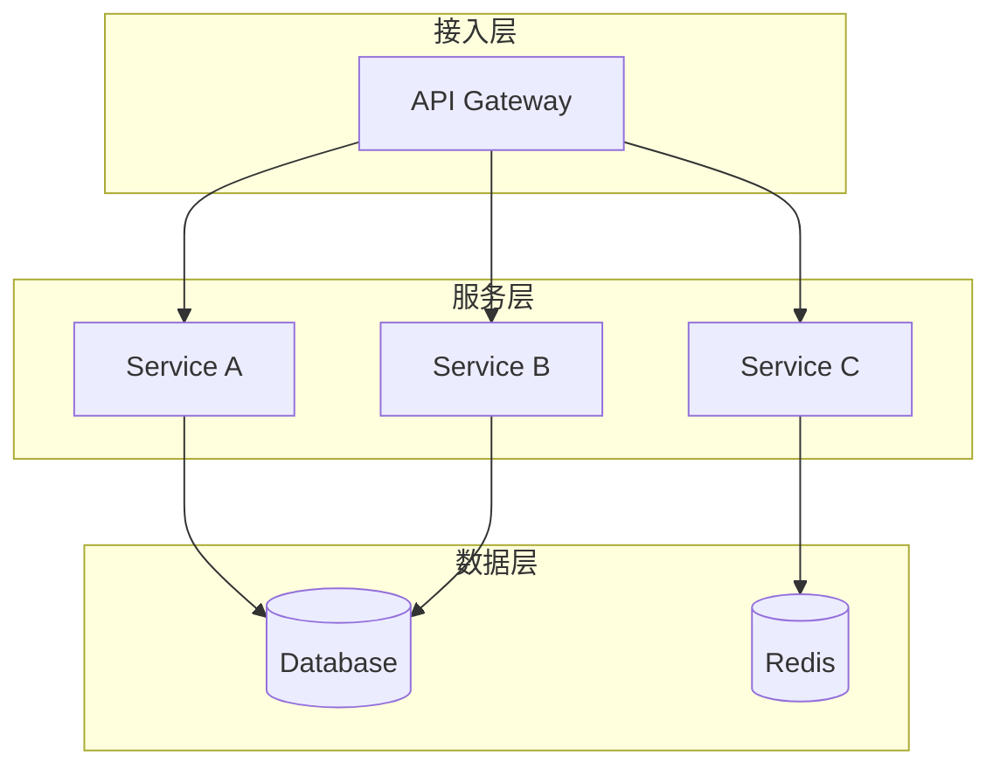
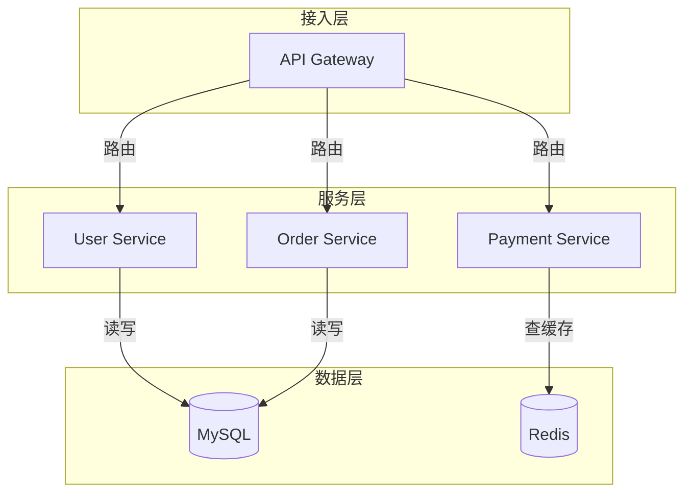

# 系统架构图执行步骤

## 1. 理解输入

识别用户描述中的关键要素：

- **组件类型**: 服务、存储、网关、缓存、队列、外部系统
- **连接关系**: 谁调用谁、数据流向、依赖关系
- **分层逻辑**: 接入层、服务层、数据层

## 2. 生成 Mermaid DSL

使用 `graph TD` (从上到下) 或 `graph LR` (从左到右) 语法。

### 结构模板

### 语法规则

- **节点定义**: `ID[标签]` (矩形)、`ID((标签))` (圆形)、`ID[(标签)]` (圆柱)
- **连线**: `-->` (实线箭头)、`-.->` (虚线箭头)、`-->|标注|-->` (带标注)
- **分组**: `subgraph 名称 ... end`

## 3. DSL 自检

生成后检查：

- [ ] 节点总数 ≤ 20
- [ ] Subgraph 嵌套层数 ≤ 3
- [ ] 每条线都有方向（箭头）
- [ ] 节点标签 ≤ 20 字符
- [ ] 中英文不混用
- [ ] 同类组件在同一 subgraph

## 4. 风格适配

根据用户选择的主题（-e/-m/-d/-c），从 themes.md 读取对应配置：

1. 提取 `BG_COLOR`、`FONT_FAMILY`、`MERMAID_VARS`
2. 将 `MERMAID_VARS` 注入 Mermaid init 配置

## 5. 输出示例

**输入**: "画一个电商系统，包含网关、用户服务、订单服务、支付服务、MySQL 和 Redis"

**输出 DSL**:

## 6. 命名生成

根据图表内容自动生成文件名（英文小写，连字符连接）：

- 电商系统架构图 → `ecommerce-system-architecture`
- 用户注册流程图 → `user-registration-flow`
