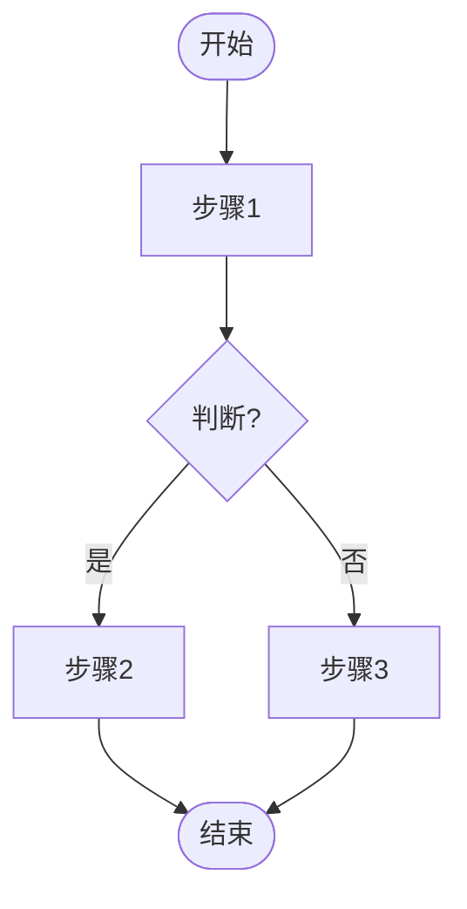
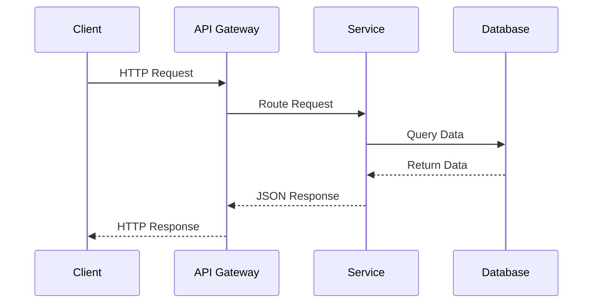
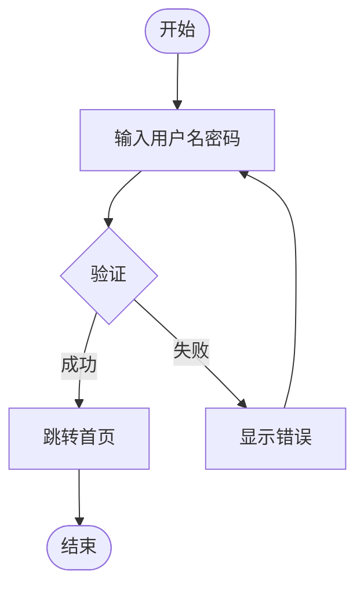
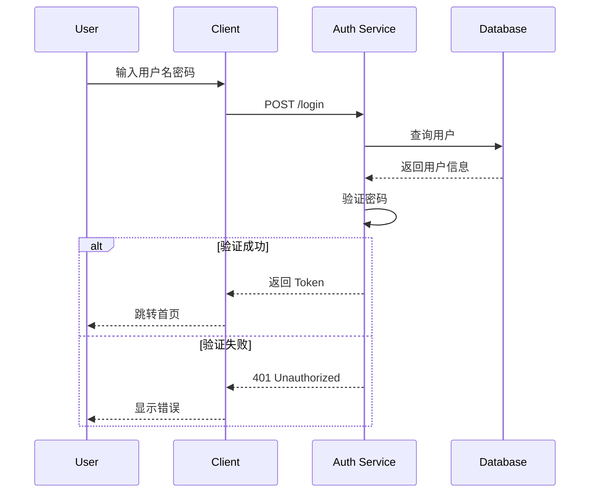

# 流程图/时序图执行步骤

## 1. 判断子类型

根据用户描述判断使用哪种语法：

| 特征 | 推荐类型 | Mermaid 语法 |
|------|----------|--------------|
| 多参与者交互 | 时序图 | `sequenceDiagram` |
| 单线流程、判断分支 | 流程图 | `flowchart TD` |

## 2. 流程图 (flowchart TD)

### 结构模板

### 节点形状

- `[文本]` - 矩形（处理步骤）
- `{文本}` - 菱形（判断）
- `([文本])` - 圆角矩形（开始/结束）
- `[(文本)]` - 圆柱形（数据库）

## 3. 时序图 (sequenceDiagram)

### 结构模板

### 消息类型

- `->>` - 实线箭头（同步消息）
- `-->>` - 虚线箭头（返回消息）
- `-x>` - 实线叉（消息丢失）
- `->>+` - 激活 lifeline（开始处理）
- `-->>-` -  deactivate lifeline（结束处理）

## 4. DSL 自检

生成后检查：

- [ ] 流程图：步骤数 ≤ 15
- [ ] 时序图：参与者数 ≤ 6
- [ ] 流程图：有明确开始和结束节点
- [ ] 判断分支：标注条件（是/否 或 success/fail）
- [ ] 时序图：消息有明确方向

## 5. 风格适配

与 mode-arch.md 相同，从 themes.md 读取配置注入 Mermaid init。

## 6. 输出示例

**输入**: "画用户登录流程，包括输入密码、验证、成功或失败跳转"

**输出 DSL (流程图)**:

**输出 DSL (时序图)**:

## 7. 命名生成

- 用户登录流程图 → `user-login-flow`
- 支付流程时序图 → `payment-process-sequence`
