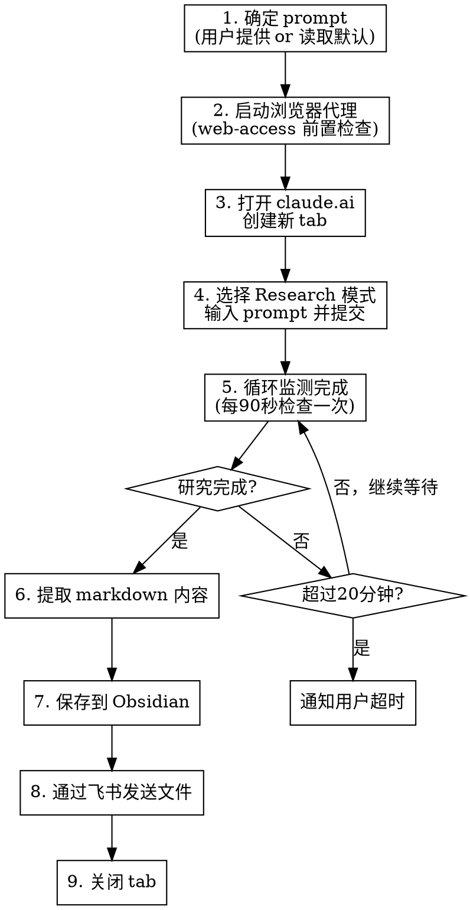

# 深度研究 - Claude Research Mode 自动化

通过浏览器自动化操作 claude.ai Research 模式，执行深度研究，自动监测完成，保存结果到 Obsidian 并通过飞书发送。

## 使用方式

```bash
# 自定义 prompt
/fc-invest-deepresearch 你的研究问题或主题

# 使用默认 prompt（每日A股/港股复盘分析）
/fc-invest-deepresearch
```

## 工作流程



### 第一阶段：准备

1. **确定 prompt**
   - 用户传入了 prompt：直接使用
   - 未传入 prompt：读取 `{baseDir}/prompts/default-daily-review.md`，将其中的 `{date}` 替换为今天的日期

2. **启动浏览器代理（CDP 模式 - 强制）**

   ⚠️ **重要**：必须使用 CDP Proxy 连接用户已有的 Chrome，**严禁**使用 Playwright MCP 等独立浏览器（sandbox 没有登录态）。

   - 加载 `web-access` skill 并执行前置检查：
   ```bash
   node "$CLAUDE_SKILL_DIR/../web-access/scripts/check-deps.mjs"
   ```

   - 如果 web-access 的 `CLAUDE_SKILL_DIR` 不可用，用绝对路径：
   ```bash
   node ~/.agents/skills/web-access/scripts/check-deps.mjs
   ```

   - **检查必须通过**：如果 `check-deps.mjs` 返回失败或超时，**立即停止执行**，不要继续。可能原因：
     - Chrome 未开启远程调试：在 Chrome 地址栏打开 `chrome://inspect/#remote-debugging` 并勾选 "Allow remote debugging for this browser instance"
     - Chrome 未运行：请启动 Chrome 后再试

   - **验证 Proxy 就绪**（必须返回 JSON 数组，哪怕是 `[]`）：
   ```bash
   curl -s http://localhost:3456/targets
   ```

### 第二阶段：操作 claude.ai（必须使用 CDP Proxy）

⚠️ **绝对禁止**：不要调用 `mcp__playwright__browser_navigate`、`mcp__playwright__browser_click` 等 Playwright MCP 工具。这些工具会启动独立的 sandbox 浏览器，没有 claude.ai 登录态。

3. **验证并打开 claude.ai**

   **再次确认 CDP Proxy 状态**（如果不可用，报错停止）：
   ```bash
   # 验证 proxy 是否返回 JSON 数组
   curl -s http://localhost:3456/targets | head -c 100
   ```

   如果返回的不是 JSON 数组（例如连接拒绝），**立即停止**并提示用户检查 Chrome 调试设置。

   **创建新 tab 打开 claude.ai**：
   ```bash
   # 创建新后台 tab（在用户已有的 Chrome 中，共享登录态）
   curl -s "http://localhost:3456/new?url=https://claude.ai"
   ```
   - 记录返回的 `targetId`，后续所有操作使用此 ID
   - 等待页面完全加载（3-5秒）

4. **进入 Research 模式并提交 prompt**

   先截图确认页面状态：
   ```bash
   curl -s "http://localhost:3456/screenshot?target=ID&file=/tmp/claude-research-init.png"
   ```

   **点击 "Add files, connectors, and more" 按钮**：
   ```bash
   # 找到并点击 aria-label="Add files, connectors, and more" 的按钮
   curl -s -X POST "http://localhost:3456/eval?target=ID" \
     -d 'const btn = document.querySelector("[aria-label=\'Add files, connectors, and more\']"); if(btn) { btn.click(); "clicked"; } else { "not found"; }'
   ```

   **选择 Research 模式**：
   ```bash
   # 等待菜单弹出后，点击 "Research" 选项
   sleep 1
   curl -s -X POST "http://localhost:3456/eval?target=ID" \
     -d 'const researchOption = Array.from(document.querySelectorAll("[role=\'menuitem\']")).find(el => el.textContent.includes("Research")); if(researchOption) { researchOption.click(); "research_selected"; } else { "research_not_found"; }'
   ```

   **输入 prompt 并提交**：
   ```bash
   # 将 prompt 填入输入框（textarea 或 contenteditable）
   curl -s -X POST "http://localhost:3456/eval?target=ID" \
     -d 'const editor = document.querySelector("[contenteditable]") || document.querySelector("textarea"); if(editor) { editor.focus(); editor.textContent = PROMPT_TEXT; "done"; } else { "editor_not_found"; }'

   # 点击发送按钮提交
   curl -s -X POST "http://localhost:3456/eval?target=ID" \
     -d 'const sendBtn = document.querySelector("[aria-label=\'Send message\']") || document.querySelector("button[type=\'submit\']"); if(sendBtn) { sendBtn.click(); "sent"; } else { "send_btn_not_found"; }'
   ```

   **关键**：claude.ai 的 UI 结构可能更新，每次操作前先截图确认，按 web-access 的浏览哲学「边看边判断」。

### 第三阶段：监测完成

5. **循环监测**

   研究一般需要 5-15 分钟。使用 `ScheduleWakeup` 或 `/loop` 每 90 秒检查一次。

   **关键：每次检查都需要先刷新页面**，因为 claude.ai Research 模式不会实时更新，需要刷新才能看到最新状态：

   ```bash
   # 刷新页面以获取最新状态
   curl -s -X POST "http://localhost:3456/eval?target=ID" -d 'location.reload(); "reloading"'

   # 等待页面加载完成
   sleep 3
   ```

   **检查研究状态**：
   ```bash
   # 检查是否完成：最底下是否出现了 group/artifact-block 元素
   curl -s -X POST "http://localhost:3456/eval?target=ID" \
     -d '(() => {
       // 研究完成的标志：页面底部出现 group/artifact-block 元素
       const artifactBlock = document.querySelector(".group\\/artifact-block");
       // 同时检查是否有研究报告内容
       const content = document.querySelector("[class*=\"markdown\"]");
       const hasContent = content && content.textContent.length > 500;
       // 检查是否仍在研究中（有停止按钮表示正在运行）
       const stopBtn = document.querySelector("[aria-label*=\"Stop\"], button[class*=\"stop\"]");
       const loading = document.querySelector("[class*=\"loading\"], [class*=\"progress\"], [class*=\"spinner\"]");
       const isResearching = !!(stopBtn || loading);

       return JSON.stringify({
         isResearching: isResearching,
         isComplete: !!artifactBlock,
         hasContent: hasContent,
         contentLength: content ? content.textContent.length : 0,
         hasArtifactBlock: !!artifactBlock
       });
     })()'
   ```

   判断逻辑：
   - `isComplete=true`（即出现了 `group/artifact-block` 元素）：研究完成，进入提取阶段
   - `isResearching=true` 且 `isComplete=false`：仍在研究中，继续等待
   - `isResearching=false` 且 `hasContent=true`：研究可能已完成但标志元素未检测到，需截图确认
   - 超过 20 分钟：截图通知用户，询问是否继续等待

   **每次检查都截图**以便观察进度：
   ```bash
   curl -s "http://localhost:3456/screenshot?target=ID&file=/tmp/claude-research-progress.png"
   ```

### 第四阶段：提取与保存

6. **提取 markdown 内容**

   研究完成后，提取完整的研究报告：
   ```bash
   # 提取研究报告的完整文本
   curl -s -X POST "http://localhost:3456/eval?target=ID" \
     -d '(() => {
       // 尝试多种选择器找到研究报告内容
       const selectors = ["[class*=\"markdown\"]", "[class*=\"prose\"]", "[class*=\"message-content\"]"];
       for (const sel of selectors) {
         const els = document.querySelectorAll(sel);
         if (els.length > 0) {
           // 取最后一个（最新的回复）
           const last = els[els.length - 1];
           return last.innerText;
         }
       }
       return "EXTRACT_FAILED";
     })()'
   ```

   如果文本提取不完整，可尝试通过 claude.ai 的复制功能或 HTML 转 markdown。

7. **保存到 Obsidian**

   ```
   目标目录：/Users/jiangfachang/Obsidian/raw/invest-daily/
   文件名格式：{YYYY-MM-DD}-{主题摘要}.md
   ```

   添加 YAML frontmatter：
   ```markdown
   ---
   date: {YYYY-MM-DD}
   source: claude.ai Research Mode
   tags:
     - 投资研究
     - 深度研究
   topic: {研究主题}
   ---

   {研究报告内容}
   ```

8. **通过飞书发送文件**

   根据环境变量情况，选择以下两种发送方式之一：

   **方式A：CLAW_SENDER_ID 可用时（Claw 渠道）**
   ```bash
   # 复制到 inbound 目录
   mkdir -p /Users/jiangfachang/.openclaw/media/inbound/
   cp "{obsidian_file_path}" /Users/jiangfachang/.openclaw/media/inbound/

   # 通过 message 工具发送
   message action=send target=${CLAW_SENDER_ID} media=/Users/jiangfachang/.openclaw/media/inbound/{filename}

   # 清理临时文件
   rm /Users/jiangfachang/.openclaw/media/inbound/{filename}
   ```

   **方式B：CLAW_SENDER_ID 不可用时（飞书 Webhook）**

   当环境变量 `CLAW_SENDER_ID` 不存在时，使用飞书 webhook 直接发送 markdown 内容：
   ```bash
   # 读取 markdown 文件内容
   CONTENT=$(cat "{obsidian_file_path}")

   # 添加来源标记
   FULL_CONTENT="${CONTENT}

---
from 小财神Bot"

   # 通过飞书 webhook 发送（分批发送，每批不超过4096字符）
   WEBHOOK_URL="https://open.feishu.cn/open-apis/bot/v2/hook/38cdd9f1-de79-4db0-a698-f1e683daf0b5"

   # 发送标题
   curl -s -X POST "${WEBHOOK_URL}" \
     -H "Content-Type: application/json" \
     -d "{\"msg_type\":\"text\",\"content\":{\"text\":\"📊 深度研究报告：{研究主题}\"}}"

   # 分批发送正文（飞书单条消息限制4096字符）
   echo "${FULL_CONTENT}" | fold -w 4000 -s | while IFS= read -r chunk; do
     # 转义特殊字符用于 JSON
     JSON_CHUNK=$(echo "${chunk}" | sed 's/\\/\\\\/g; s/"/\\"/g; s/\n/\\n/g; s/\t/\\t/g')
     curl -s -X POST "${WEBHOOK_URL}" \
       -H "Content-Type: application/json" \
       -d "{\"msg_type\":\"text\",\"content\":{\"text\":\"${JSON_CHUNK}\"}}"
     sleep 0.5
   done

   # 发送完成标记
   curl -s -X POST "${WEBHOOK_URL}" \
     -H "Content-Type: application/json" \
     -d '{"msg_type":"text","content":{"text":"✅ 报告发送完毕\nfrom 小财神Bot"}}'
   ```

   **发送逻辑判断**：
   - 如果 `CLAW_SENDER_ID` 环境变量存在 → 使用方式A（原文件发送）
   - 如果 `CLAW_SENDER_ID` 不存在 → 使用方式B（webhook 发送 markdown 内容）

9. **清理**

   ```bash
   curl -s "http://localhost:3456/close?target=ID"
   ```

## 注意事项

- **浏览器选择（极其重要）**：
  - ✅ **CDP Proxy (`localhost:3456`)**：连接用户已有的 Chrome，保留登录态
  - ❌ **Playwright MCP**：启动独立 sandbox 浏览器，**没有登录态**，会导致需要重新登录
  - **如果 CDP Proxy 不可用，立即停止执行**，不要自动切换到其他浏览器工具

- **登录态**：确保用户 Chrome 已登录 claude.ai（Pro/Team 订阅才有 Research 模式）
- **界面变化**：claude.ai 前端可能更新，DOM 选择器需要根据实际截图调整，不要盲目重试
- **刷新机制**：Research 模式不会实时推送更新，每次检查前必须刷新页面才能看到最新进度
- **完成标志**：以页面底部出现 `group/artifact-block` 元素作为研究完成的判断依据
- **超时处理**：超过 20 分钟未完成，截图通知用户而非无限等待
- **内容完整性**：提取 markdown 后检查内容长度是否合理（研究报告通常 > 2000 字）
- **不要操作用户已有 tab**：所有操作在新建 tab 中进行
