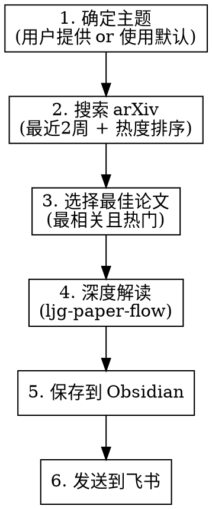

# Paper Read - AI 论文自动阅读

自动搜索 arXiv 最新热门论文，深度解读并保存到知识库。

## 使用方式

```bash
# 使用默认主题（AI、LLM、Agent）
/fc-paper-read

# 指定主题搜索
/fc-paper-read "reinforcement learning"
/fc-paper-read "multimodal"
/fc-paper-read "vision transformer"
```

## 工作流程



### 第一阶段：确定主题

1. **解析用户输入**
   - 用户提供了主题：使用该主题进行搜索
   - 未提供主题：使用默认主题 `AI OR LLM OR Agent`

2. **构建搜索关键词**
   - 将用户主题转换为 arXiv 搜索语法
   - 限定搜索范围为 `cs.AI` 或 `cs.CL` 等 AI 相关分类

### 第二阶段：搜索 arXiv

3. **使用 web-access 搜索论文**

   **前置检查：**
   ```bash
   node "$CLAUDE_SKILL_DIR/../web-access/scripts/check-deps.mjs"
   ```

   **打开 arXiv 高级搜索：**
   ```bash
   # 构造搜索 URL（最近2周 + AI 分类 + 按提交日期排序）
   curl -s "http://localhost:3456/new?url=https://arxiv.org/search/advanced?query=$(echo 'YOUR_TOPIC' | jq -sRr @uri)&classification=cs&date-date_type=submitted_date&date-from_date=TWO_WEEKS_AGO&date-to_date=TODAY&order=-announced_date_first"
   ```

   **提取论文列表：**
   ```bash
   # 从页面提取论文信息（标题、链接、作者、摘要、提交日期）
   curl -s -X POST "http://localhost:3456/eval?target=ID" \
     -d '(() => {
       const papers = [];
       const items = document.querySelectorAll("li.arxiv-result");
       items.forEach(item => {
         const titleEl = item.querySelector("p.title");
         const linkEl = item.querySelector("a[href*=\"/abs/\"]");
         const authorsEl = item.querySelector("p.authors");
         const abstractEl = item.querySelector("p.abstract");
         const dateEl = item.querySelector("p.is-size-7");

         if (titleEl && linkEl) {
           papers.push({
             title: titleEl.textContent.trim(),
             url: linkEl.href,
             authors: authorsEl ? authorsEl.textContent.trim() : "",
             abstract: abstractEl ? abstractEl.textContent.trim().substring(0, 300) + "..." : "",
             date: dateEl ? dateEl.textContent.trim() : ""
           });
         }
       });
       return JSON.stringify(papers.slice(0, 10)); // 取前10篇
     })()'
   ```

   **获取热度信息：**
   - 对每篇论文，访问其 arXiv 页面获取浏览量、引用数等指标
   - 或直接根据提交时间和相关性综合判断

### 第三阶段：选择论文

4. **选择最佳论文**

   从搜索结果中选择 **1篇** 最符合以下标准的论文：
   - 与主题高度相关
   - 发布时间在最近2周内
   - 标题/摘要显示有较高关注度或创新性

   **返回选定论文的 arXiv URL**（如 `https://arxiv.org/abs/2501.01234`）

### 第四阶段：深度解读

5. **调用 ljg-paper-flow 技能**

   ```bash
   Skill(skill="ljg-paper-flow", args="") 
   # 在调用前，将选定的论文 URL 通过对话上下文传递
   ```

   或者使用子 Agent 方式：
   - 启动子 Agent，加载 `ljg-paper-flow` 技能
   - 子 Agent 自动完成：读论文 → 生成解读 → 铸成卡片
   - 获取生成的 markdown 文件路径

### 第五阶段：保存到 Obsidian

6. **移动文件到知识库**

   ```bash
   # ljg-paper-flow 默认保存位置
   SOURCE_DIR="/Users/jiangfachang/.claude/skills/ljg-paper/output"

   # 目标 Obsidian 目录
   TARGET_DIR="/Users/jiangfachang/Obsidian/SecondBrain/论文/AI论文"

   # 确保目录存在
   mkdir -p "$TARGET_DIR"

   # 移动 markdown 文件
   mv "$SOURCE_DIR"/*.md "$TARGET_DIR/" 2>/dev/null || true
   ```

   **添加额外元数据（可选）：**
   ```markdown
   ---
   date: {YYYY-MM-DD}
   source: arXiv
   tags:
     - 论文
     - AI
     - {主题}
   search_topic: {用户输入的主题}
   arxiv_url: {论文URL}
   ---
   ```

### 第六阶段：发送到飞书

7. **通过飞书发送文件**

   使用 `retrieve-original-file` 技能将保存的 markdown 文件发送给用户：
   ```bash
   # 复制到 inbound 目录
   mkdir -p /Users/jiangfachang/.openclaw/media/inbound/
   cp "$TARGET_DIR/{filename}.md" /Users/jiangfachang/.openclaw/media/inbound/

   # 通过 message 工具发送（如果在飞书渠道）
   # message action=send target=${CLAW_SENDER_ID} media=/Users/jiangfachang/.openclaw/media/inbound/{filename}.md
   ```

   **注意**：如果 `CLAW_SENDER_ID` 不可用（非飞书渠道触发），跳过发送步骤，仅告知用户文件已保存到 Obsidian。

## 配置

### 环境变量

在 `{baseDir}/config/.env` 中配置：

- `DEFAULT_TOPIC` - 默认搜索主题（可选，默认为 "AI OR LLM OR Agent"）
- `FEISHU_WEBHOOK_URL` - 飞书机器人 Webhook 地址（可选）

### 默认主题

当用户未指定主题时，使用以下默认主题：
- `AI OR LLM OR Agent OR "large language model" OR "artificial intelligence"`

## 数据存储

- Obsidian 知识库：`~/Obsidian/SecondBrain/论文/AI论文/`
- 临时文件：`{baseDir}/data/`
- 日志：`{baseDir}/data/paper-read.log`

## 依赖技能

- **web-access**: 用于浏览器自动化搜索 arXiv
- **ljg-paper-flow**: 用于论文深度解读
- **retrieve-original-file**: 用于发送文件到飞书（可选）

## 注意事项

- **arXiv 反爬**：搜索时避免过于频繁的请求，使用合理的等待时间
- **论文选择**：只选择 **1篇** 最相关且热门的论文进行深入解读
- **时间范围**：严格限制在 **最近2周内** 发布的论文
- **内容完整性**：确保提取的论文信息包含标题、作者、摘要和链接
